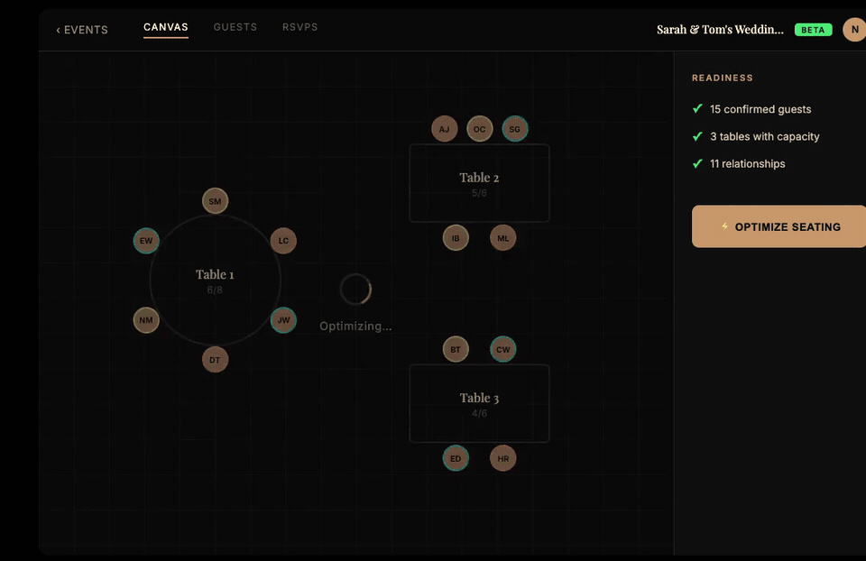

# CSS Animation Skill for Claude Code

[](https://discord.gg/7xsxU4ZG6A)

A Claude Code skill that generates self-contained HTML/CSS animations of app features — for walkthroughs, demos, and onboarding.



## Why not GIFs?

| | CSS Animation | GIF/Video |
|---|---|---|
| Resolution | Vector-sharp at any size | Fixed pixels |
| File size | ~30KB HTML | 500KB–5MB |
| Editable | Yes, it's just code | Re-record from scratch |
| Iteratable | Edit CSS, refresh | Re-record from scratch |
| Controllable | Pause, slow down, inspect | Play/pause only |

## How it works

The skill follows a 4-phase workflow:

1. **Research** — Navigates your live app via Claude-in-Chrome to extract design language (colors, fonts, spacing) and layout geometry (positions, dimensions)
2. **Interview** — Asks 3-6 focused questions about what to animate, the style (feature demo or carousel), and the key "payoff moment"
3. **Generate** — Produces a structured brief (markdown) and a self-contained HTML file with CSS transitions and minimal JS
4. **Review Loop** — Freeze-inspect-feedback cycle: stops the animation at each key state, screenshots it, collects feedback, fixes, and re-inspects until approved

## Animation styles

- **Feature Demo** — Before → Action → After. Shows a single feature transformation (e.g., clicking "Optimize" and watching seats rearrange)
- **Carousel** — Multi-view. Cycles through several app screens with cross-fade transitions

## Output

Each run produces two files:

- `<app>-<feature>-brief.md` — Structured spec capturing design language, layout, and animation plan
- `<app>-<feature>.html` — Self-contained animation (HTML + CSS + minimal JS, no dependencies except Google Fonts)

## Installation

Copy the skill file to your Claude Code skills directory:

```bash
mkdir -p ~/.claude/skills/css-animation
cp SKILL.md ~/.claude/skills/css-animation/SKILL.md
```

Then trigger it in Claude Code with phrases like: "css animation", "animate this feature", "create a css walkthrough"

## Requirements

- Claude Code with Claude-in-Chrome MCP tools
- A target app accessible in the browser

## Examples

See the `examples/` directory for sample animations and their briefs.
